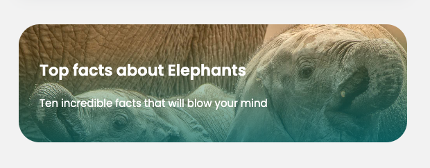
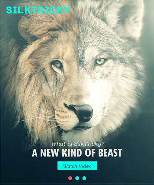
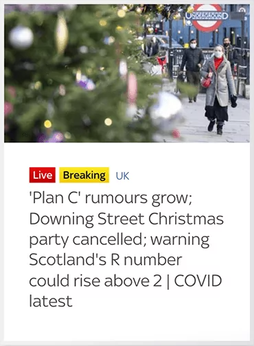

# Assignment D
This is your remote assignment D repository readme file. You are seeing this file because you have successfully accepted the assignment link and GitHub automatically created a remote repository for you.
## Objectives
Practice working with the CSS box model to create some typical web card layouts.

## Instructions
Clone this repository onto your local computer.

### Step 1:
In VS Code, add the following styles to the article element with the class name card-one:
   * Make the image round by using the border-radius property.
   * Give the card a background colour of `hsl(0, 0%, 100%)`.
   * Make the width of the card 500px.
   * Give the card a 50px margin on all four sides so that it isn't so close to the browser window's edges.
   * Give the card 30px of padding on all four sides so that the content doesn't touch the edges of the card.
   * Round the corners of the card by a 5px radius.
   * Give the card a top border that is 3px thick, solid in style and of the color `hsl(180, 62%, 55%)`.
   * Give the card a shadow. Go to https://getcssscan.com/css-box-shadow-examples to find a pleasing shadow.
 When you are finished the card should look like this:  
 

### Step 2:
Add the following styles to the article element with the class name card-two:
   * Give the card a background colour of `hsl(234, 12%, 34%)`.
   * Give the card the same margin and padding as card one.
   * Change the width of card so that it matches the visual width of card one.
   * Round the corners of the card by a 30px radius.
   * Make the card's h2 and p elements white;
   * Play with background properties:
      * Using the background CSS property, add a gradient to the card's background. Go to https://cssgradient.io/ to create a gradient that you like.
      * Give the card a background image that uses the elephant image available in the images folder (the background image will hide the gradient).
      * Try out different background-size values until you find one that you like: https://developer.mozilla.org/en-US/docs/Web/CSS/background-size.
      * Combine your gradient with the image by copying and pasting the gradient in front of the image url - don't forget the comma in between the two.  
      Ex: `background-image: linear-gradient(356deg, rgba(34,193,195,1) 0%, rgba(253,187,45,0.022846638655462215) 100%), url('images/elephants.jpeg');`
   * Just for fun, see what happens when you apply `filter: grayscale(100%);` to the card so that the whole card becomes grayscale.
 When you are finished, but before the grayscale filter, the card should look like this:  
 

### Step 3:
Recreate the card below. Try to use similar fonts (Google Fonts), colours, image, alignment and spacing. You can source an image from a website such as https://www.unsplash.com or https://www.pexels.com. Be as exact as you can with your styling, pixel-perfect if possible. 

### Step 4:
Recreate the card below. Try to use similar fonts (Google Fonts), colours, image, alignment and spacing. You can source an image from a website such as https://www.unsplash.com or https://www.pexels.com. Be as exact as you can with your styling, pixel-perfect if possible. 

### Step 5: Validate your work
1. Go to https://validator.w3.org/#validate_by_upload to validate your HTML. Take a screenshot
2. Go to https://jigsaw.w3.org/css-validator/#validate_by_upload to validate your CSS. Take a screenshot.

### Step 5: Submit your work
Complete the following steps from the GitHub and GitHub Desktop Reference Guide:
1. Commit your changes if you’ve made changes since the last commit.
2. Push your changes to GitHub.
3. Submit your assignment in BrightSpace:
You can access the assignment submission tool by navigating to the week’s assignment in the Content Area, or by clicking on Assignments in the main menu. 
    * Click on the assignment submission link and follow the provided instructions. 
    * Don’t forget to answer the questions and attach the screenshots of your final W3 HTML and CSS validation results.
4. If you have been using a lab computer at the Comox Valley Campus to do your work with GitHub Desktop, remember to shutdown or restart the computer before you leave the room, so that other students won’t have access to your repositories.

## Deadlines
Assignments must be submitted before the end of the week but they will only be graded at the end of every unit. Late assignments will not be accepted and will receive an F. You can complete and submit a contract that allows you to extend the deadline for an assignment but you must email it to your instructor a minimum of 48 hrs before the deadline. Deadline extensions are only allowed for those unplanned, unexpected emergencies that life sometimes throws at us, and they will only be approved by your instructor if you follow the correct process. See the Course Info folder in BrightSpace for more info.